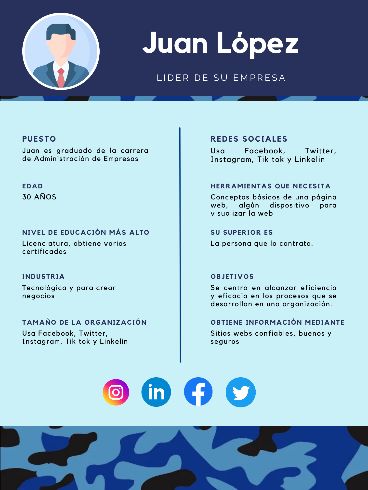
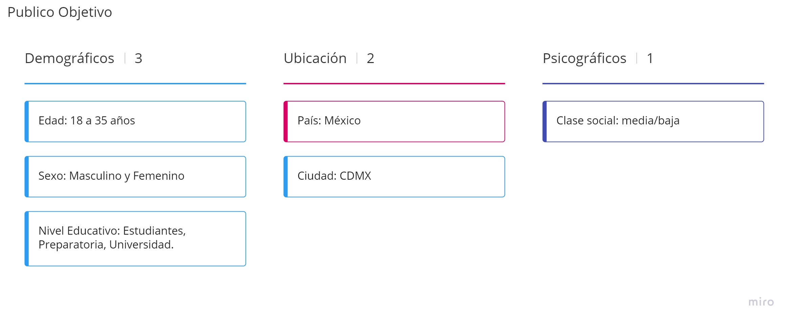
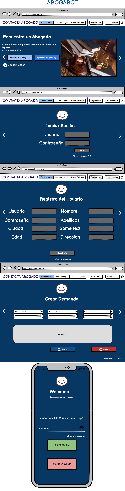
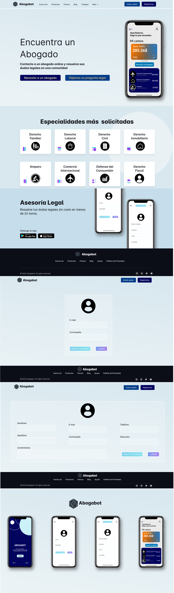

# FrontEnd-Mision 🚀
### Prácticas de Intro a Frontend

1. [Requerimientos](https://github.com/JoseDelVallee/FrontEnd-Mision/blob/main/Pr%C3%A1ctica1/Requerimientos%20Abogabot.pdf)
2. [Buyer Persona](https://github.com/JoseDelVallee/FrontEnd-Mision/blob/main/Pr%C3%A1ctica1/Buyer%20Persona.png)
3. [Público Objetivo](https://github.com/JoseDelVallee/FrontEnd-Mision/blob/main/Pr%C3%A1ctica1/P%C3%BAblico%20Objetivo.pdf)
4. [Wireframe UX](https://github.com/JoseDelVallee/FrontEnd-Mision/blob/main/Pr%C3%A1ctica1/Wireframe%20UX%20Abogabot.pdf)
5. [UI](https://github.com/JoseDelVallee/FrontEnd-Mision/blob/main/Pr%C3%A1ctica1/UI%20Abogabot.pdf)

### 1) [Toma de requerimientos](https://github.com/JoseDelVallee/FrontEnd-Mision/blob/main/Pr%C3%A1ctica1/Requerimientos%20Abogabot.pdf)

### Caso: Abogabot

### Descripción:

Es un despacho de abogados que quiere automatizar las demandas de sus clientes, esto lo harán a traves de una página web llenando un formulario

### 2) [Buyer Persona](https://github.com/JoseDelVallee/FrontEnd-Mision/blob/main/Pr%C3%A1ctica1/Buyer%20Persona.png)

### 3) [Público Objetivo](https://github.com/JoseDelVallee/FrontEnd-Mision/blob/main/Pr%C3%A1ctica1/P%C3%BAblico%20Objetivo.pdf)

### 4) [UX de Wireframe](https://github.com/JoseDelVallee/FrontEnd-Mision/blob/main/Pr%C3%A1ctica1/Wireframe%20UX%20Abogabot.pdf)

### 5) [UI de Wireframe](https://github.com/JoseDelVallee/FrontEnd-Mision/blob/main/Pr%C3%A1ctica1/UI%20Abogabot.pdf)

